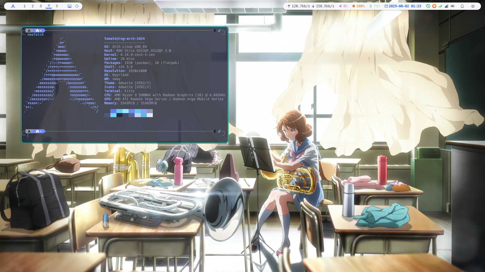
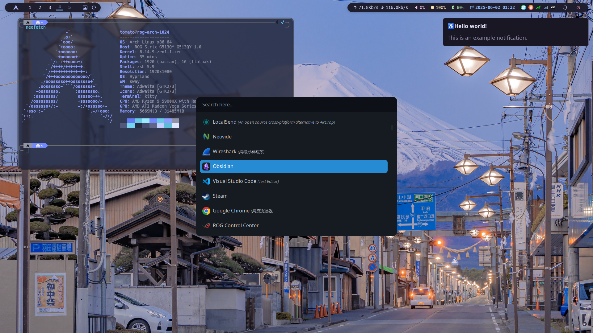
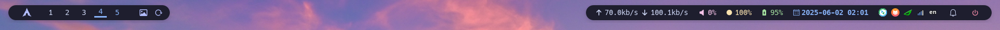
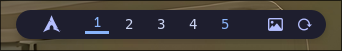

# My Dotfiles
> The following content is mostly generated by generative LLM. Please be careful to distinguish.

Personal dotfiles for my Linux system, featuring a modern and productive development environment.

## 💻 Hardware & Software
### Hardware
- **Laptop**: Asus ROG Strix G513QY
- **CPU**: AMD Ryzen 9 5900HX
- **GPU**: AMD Radeon RX 6800M
- **Display**: 165Hz QHD Display

### Software
- **OS**: Arch Linux
- **WM**: Hyprland (Wayland)
- **Terminal**: Kitty
- **Bar**: Waybar
- **Launcher**: Rofi
- **Notifications**: SwayNC

## My Applications

    
🎨 Hyprland

TODO...

    
📊 Waybar

### Overview
♿♿♿

### Workspaces & Window Management

The left sidebar configuration of Waybar includes custom/launcher (to launch the Rofi menu), hyprland/workspaces (to display 5 sequentially ordered workspace icons, click to activate), custom/wallpaper (click to switch wallpapers), and custom/changemodel (click to toggle between light and dark themes).

### System & Media Modules
♿♿♿

### Customization & Extensibility
♿♿♿

    
🔔 SwayNC

TODO...

    
🎯 Rofi

TODO...

    
🐱 Kitty

TODO...

## ⌨️ Keybindings

    
KeyBind

### Window Management
- `Super + Return` - Open terminal
- `Super + Shift + Return` - Open floating terminal
- `Super + Q` - Close window
- `Super + F` - Toggle floating
- `Super + P` - Toggle pseudo-tiling
- `Super + J` - Toggle split direction
- `Super + F12` - Toggle fullscreen
- `Super + B` - Toggle window titlebar

### Workspace Control
- `Super + 1-0` - Switch to workspace 1-10
- `Super + Shift + 1-0` - Move window to workspace 1-10
- `Super + Left/Right` - Switch to previous/next workspace
- `Super + S` - Toggle special workspace
- `Super + Tab` - Toggle workspace overview

### Application Launcher
- `Super + V` - Open clipboard history
- `Alt + Space` - Toggle Rofi launcher

### Media Controls
- `Print` - Full screenshot
- `Shift + Print` - Area screenshot
- `Super + Print` - Full screenshot with cursor
- `Super + Shift + Print` - Area screenshot with cursor

### Volume & Brightness
- `XF86AudioRaiseVolume` - Volume up
- `XF86AudioLowerVolume` - Volume down
- `XF86AudioMute` - Toggle mute
- `XF86MonBrightnessUp` - Brightness up
- `XF86MonBrightnessDown` - Brightness down

## 📝 License
WTFPL license
